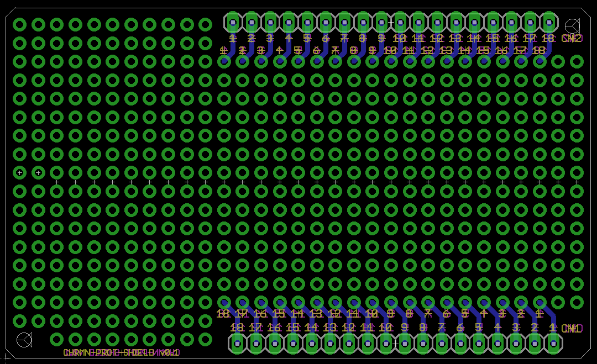

## desc

`CHRMN-PROT-SHIELD`は2.54mmピッチのユニバーサル基板シールドです。

## design

Eagle 7.3で作成しています。詳細は下記を参照ください。

- [board(v0.1)](./v0.1/CHRMN-PROT-SHIELD.brd)
- [Schematic(v0.1)](./v0.1/CHRMN-PROT-SHIELD.sch)

### garber files

[Elecrow](https://www.elecrow.com/)用に出力したgarberファイルです。

- [v0.1](./v0.1/forELECROW)

## License

[CHIRIME License](https://chirimen.org/license/)を参照ください。

